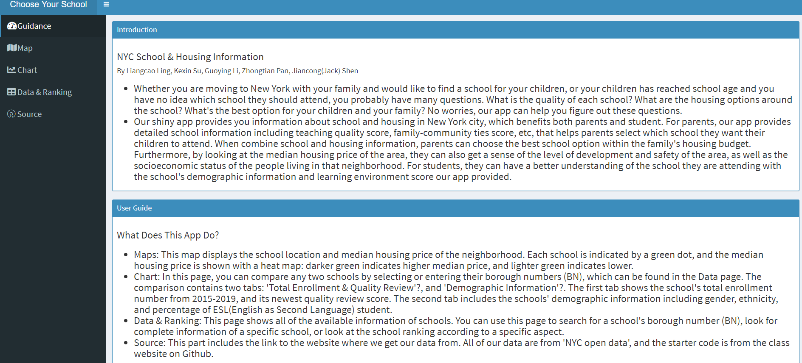
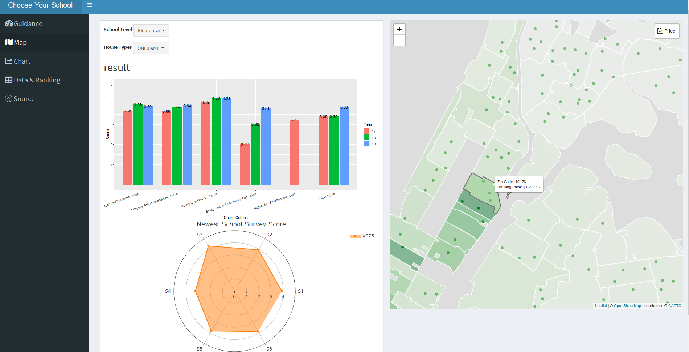
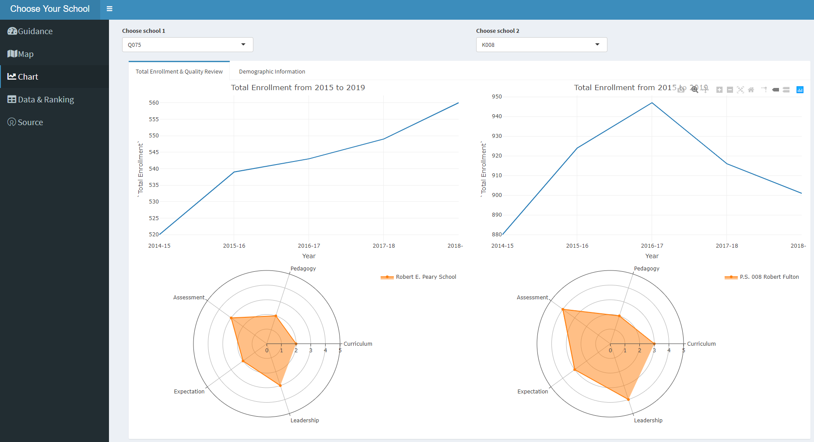
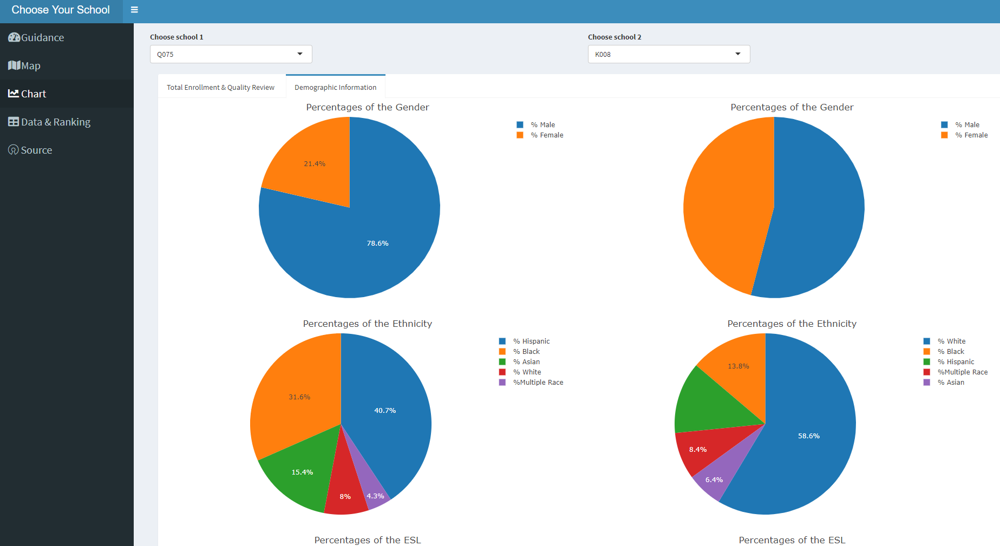

# Project 2: Shiny App Development Version 2.0





## NYC School and Housing Map
Term: Spring 2020

Scan the QR code below to open this app on the mobile terminal:  


+ Team #6
+ Shiny Link: https://nycschool.shinyapps.io/app1/
+ Team Members:
     + Liangcao Ling
     + Kexin(Colleen) Su
     + Guoying Li
     + Zhongtian Pan
     + Jiancong Shen

+ **Project summary**: 
Whether you are moving to New York with your family and would like to find a school for your children, or your children has reached school age and you have no idea which school they should attend, you probably have many questions. What is the quality of each school? What are the housing options around the school? What's the best option for your children and your family? No worries, our app can help you figure out these questions.

    Our shiny app provides you information about school and housing in New York city, which benefits both parents and student.  For parents, our app provides detailed school information including teaching quality score, family-community ties score, etc, that helps parents select which school they want their children to attend. When combine school and housing information, parents can choose the best school option within the family housing budget. Furthermore, by looking at the median housing price of the area, they can also get a sense of the level of development and safety of 
the area, as well as the socioeconomic status of the people living 
in that neighborhood. For students, they can have a better understanding of the school they are attending with the school demographic information and learning environment score our app provided.

+ **Data Source**:
We used data from NYC Open Data, including housing, school quality review, school survey, demographic information, etc. 

+ **Contribution statement**: All team members contributed equally in all stages of this project. 

     + Liangcao Ling built the structure for the whole rshiny app and plotted the map, debug for whole coding part, managed the project, contributed to the Github repository and prepared the presentation. 

     + Kexin(Colleen) Su suggested the basic idea of this app, cleaned and manipulated the school survey data, helped manipulate the quality review data, wrote function for plotting school survey data used in the "map" page, and wrote the content for introduction and user guide for the "Guidance" page, initiated the written parts, including the introduction, user guide and other descriptions on the app.

     + Guoying Li manipulated the data and plotted the eight demographic charts for the comparison between two schools, initiated the written parts, including the introduction, user guide and other descriptions on the app.

     + Zhongtian Pan manipulated the housing data and quality review data, demonstrated housing price onto the map, plot the school quality review for comparison between schools, optimized UI of guidance and source, white documentations of the repo, suggested the idea of the comparison page. 

     + Jiancong(Jack) Shen manipulated data in housing and school survey, demonstrated the house types button on the map, suggested the graph types in the comparison chart, targetted some loopholes and errors in the code, plotted the school survey charts.

All team members approve our work presented in this GitHub repository including this contributions statement. 

Following [suggestions](http://nicercode.github.io/blog/2013-04-05-projects/) by [RICH FITZJOHN](http://nicercode.github.io/about/#Team) (@richfitz). This folder is orgarnized as follows.

```
proj/
├── app/
├── lib/
├── data/
├── doc/
└── output/
```

Please see each subfolder for a README file.

